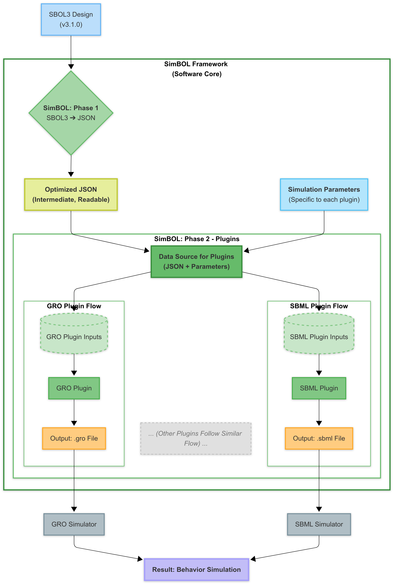

## SimBOL: SBOL Designs, Ready for Simulation 

This tool automates the conversion of genetic circuit designs from SBOL3 format (v3.1.0) into files ready for simulation.

### How does it do it? 

SimBOL uses two-step process:

1.  First, it translates your SBOL3 design into a **optimized, easy-to-understand JSON format**. This JSON as a clear, concise summary of your circuit – much simpler to work with than raw SBOL3.
2.  This special JSON then acts as a universal key, ready to be used by different **simulator-specific "plugins"**.

### What's SimBOL All About?

This tool connects the specification of a design—that is, its components, how they interconnect, and the function they must perform—with various simulators to predict its actual behavior.

The process works as follows: an initial design file is first transformed into an optimized and summarized JSON. This JSON then serves as a standardized input for different plugins, each developed for a specific simulator. If necessary, this configuration can be supplemented by a user interface or an additional parameter file, allowing for the adjustment of specific details that each simulator plugin needs to operate correctly.

### How It's Organized

The project is set up to be modular, which is just a fancy way of saying it's in logical pieces:

* `sbol3_to_json_converter/`: This is where the first step happens – reading SBOL3 and creating that optimized JSON.
    * `process_sbol.py`: The brains of the SBOL processing and JSON creation.
    * `upload_sbol_file.py`: A little helper for uploading files in Colab.
    * `rdf_parser.py`, `clean_json.py`: Other helper bits.
COMPLETAR AQUÍ
* `json_to_gro_generator/`: This section is all about the **GRO-specific plugin**.
    * `gro_file_compiler.py`: Takes the JSON and your settings to build the `.gro` file.
    * `params.py`: Gets all the GRO-specific details ready.
    * `ui_parameters.py`: Creates the interactive settings panel for GRO.
* `example_data/`: Sample SBOL3 files to try, plus examples of the intermediate JSON and the final `.gro` files.
* `README.md`
* `USER_MANUAL_GRO_PLUGIN.md`: For more detailed instructions of gro plugin.

### Get Started with SimBOL's GRO Plugin 

The simplest way to try out SimBOL (using the GRO plugin) is directly with our public Google Colab notebook.

1.  **Open in Colab:**
    * Click the badge below to open the notebook directly in Google Colab:
      

2.  **Run the Notebook:**
    * Simply follow the instructions within the notebook and run the cells in order. The notebook will handle the entire process:
        * Cloning the SimBOL repository and installing all necessary dependencies.
        * Allowing you to upload your design file in SBOL3 format.
        * Automatically converting your SBOL3 design into the optimized intermediate JSON format (which will also be downloaded for you to review).
        * Displaying the user-friendly interface for you to configure GRO-specific parameters.
        * Generating your simulation-ready `.gro` file and and downloading it automatically.

### License

This project is shared under the MIT License.
